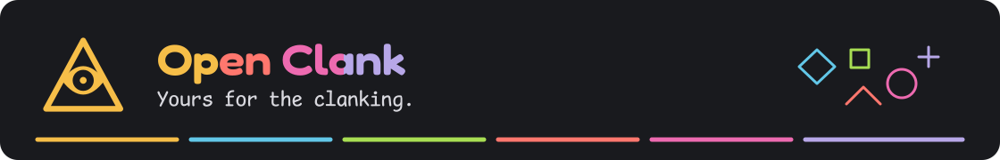
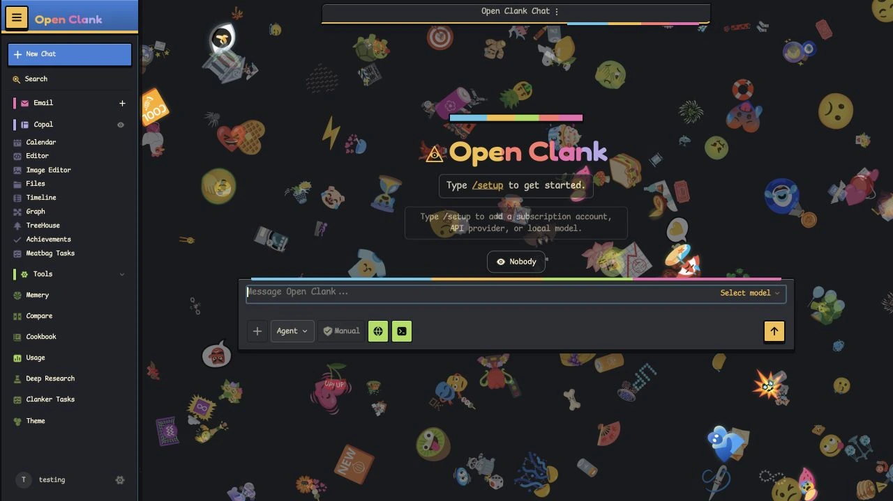
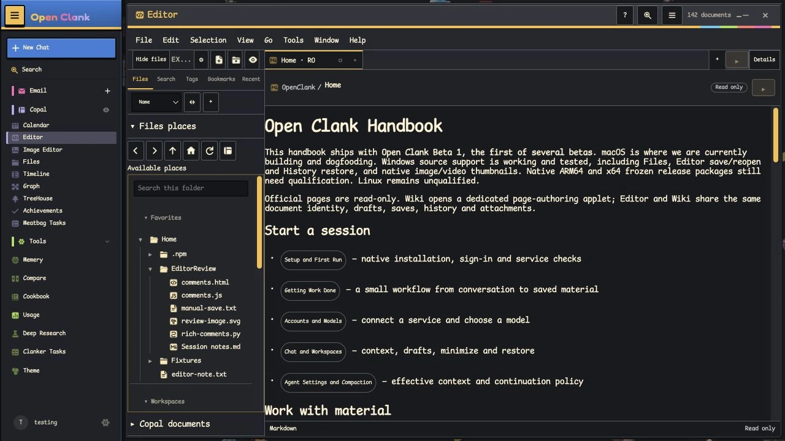
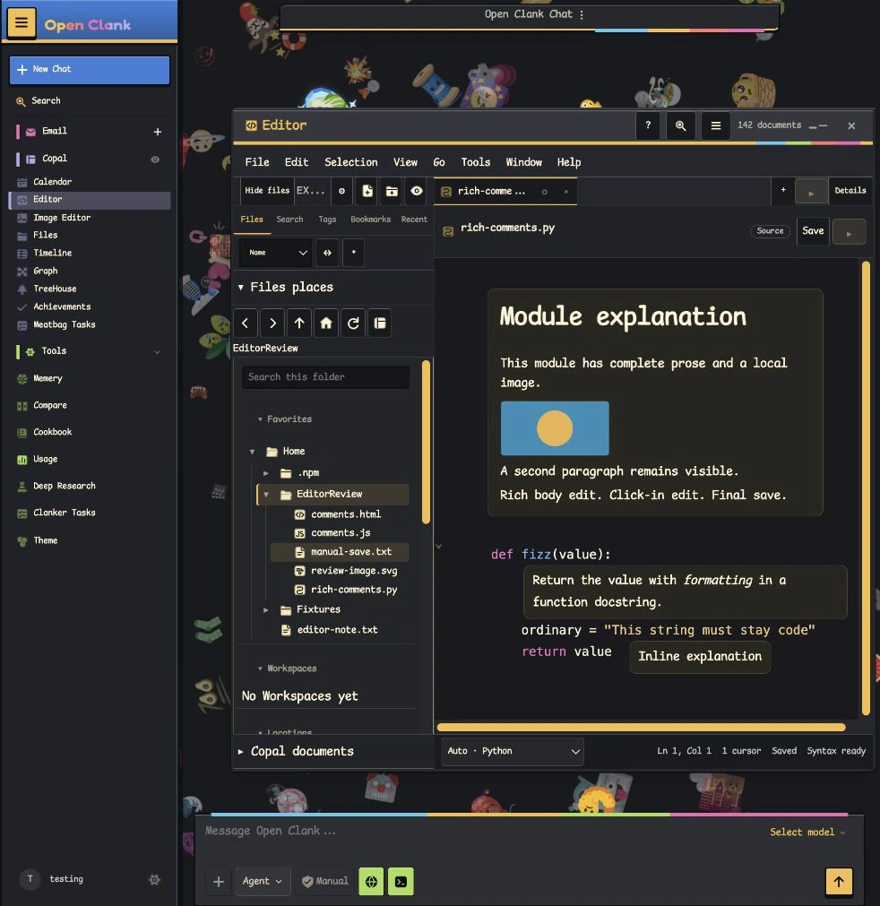
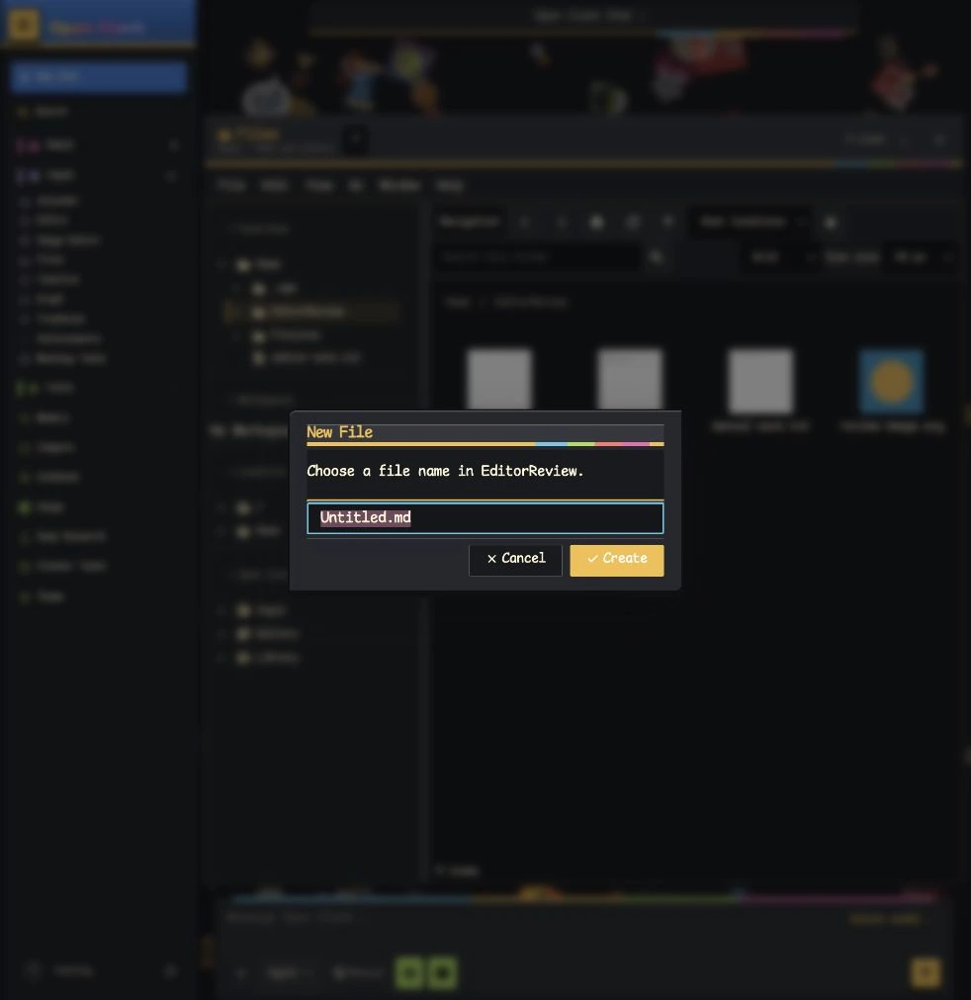
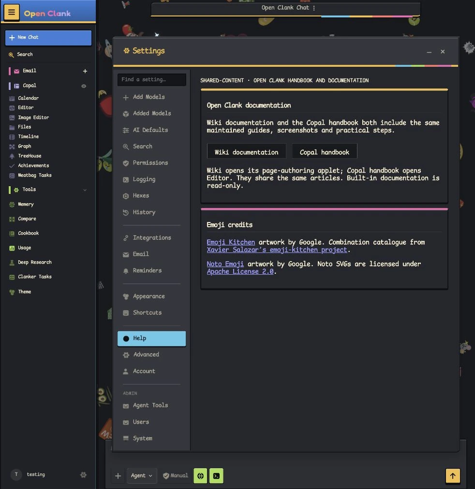
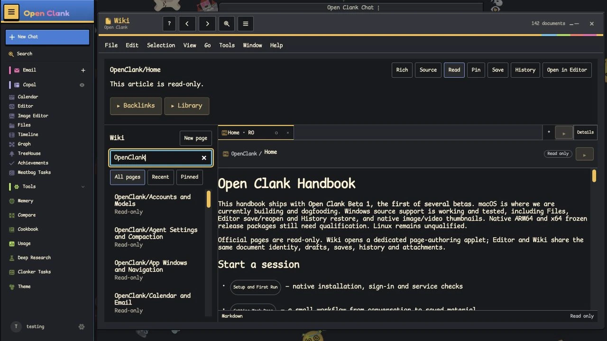
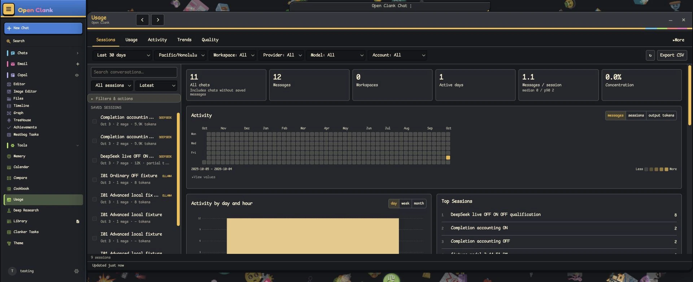

# Open Clank · Beta 1



A self-hosted workspace for talking to models, letting agents use tools, and
keeping files, knowledge and work together.

**[Start on macOS](#start-on-macos)** · **[Explore the workspace](#everyday-work)** ·
**[Other installs](#other-installation-paths)** · **[Handbook](#documentation)** ·
**[Credits](#credits-and-license)**



*Current sidebar and empty Chat welcome view with Emoji Drift, using synthetic Testing data.*

> **Beta 1 is the first of several betas.** macOS is where we are building and
> dogfooding. Windows source support is working and tested, including Files,
> Editor save/reopen and History restore, and native image/video thumbnails.
> Native ARM64 and x64 Windows packages are being qualified separately; use only
> the architectures offered by the published release. Linux support is coming later. Read the [Beta 1 notes](docs/beta1.md) and
> [known limits](docs/known-limits.md).

## Everyday work

Start with **Files** to create or find material, **Editor** to work with
documents and source, and **Wiki** for linked pages and rich authoring. Open Files and choose **File → New file…**, select a writable destination,
then open the result in Editor.

| Make room for… | What you can do |
| --- | --- |
| 💬 **Models and agents** | Chat with connected or local models; use agent tools within account scopes. |
| 📁 **Files and knowledge** | Browse approved host locations and managed material; write documents and source in Editor; link pages and embed sections in Wiki. |
| 🎨 **Making things** | Use tables, templates and source comments; edit image projects in Imps and find images through Files. |
| 🗓️ **Keeping things moving** | Work with tasks, calendar, email and reminders; learn through TreeHouse. |
| 🔎 **Understanding your work** | Search and research; review Usage, optional advanced Logging, Memery/Skills and workspace Hexes. Supported History recovery has limits and is not a backup. |
| ✨ **A workspace that feels like yours** | Choose themes and arrange applet windows, tabs and splits. |

Features depend on configured models, connections and permissions. Provider
services may charge for API use or require their own subscription.

The inherited Odysseus document editor is no longer an improvement target.
Editor and Wiki own future authoring work; existing document data and email
compatibility paths remain available.

Editor and Wiki share the document draft and Undo history. Choose **Save** or
Command/Control+S to persist changes; closing dirty work offers Save, Discard or
Cancel. Local draft recovery and window navigation do not save the document.
Source comments support click-in rich prose; right-click reveals raw source.
Managed folders show direct children in a nested, paged hierarchy. Applets use
thin frames and maximize beside the retained navigation.

## Start on macOS

The Apple Silicon source installation has passed fresh-install qualification.
Install Homebrew, ARM-native Python 3.11 or later,
[Rust/Cargo](https://rustup.rs/) and Xcode Command Line Tools (`xcode-select --install`).
The release label is `v1.0.2-beta.1`; its downloads become available when the
[release is published](https://github.com/Plaer1/open-clank/releases).
Download `open-clank-1.0.2-beta.1-source.tar.gz` and the five matching artwork
parts plus `emoji-assets.parts.json`, then extract the source archive:

```bash
tar -xzf open-clank-1.0.2-beta.1-source.tar.gz
cd open-clank-1.0.2-beta.1
python3 scripts/emoji_asset_bundle.py assemble --parts /path/to/emoji-parts
python3 scripts/emoji_asset_bundle.py verify
./start-macos.sh
```

Follow [the complete artwork instructions](docs/setup.md#offline-emoji-artwork)
for downloading and verifying the parts. A source archive or Git clone alone
omits the artwork. This is a source build, not a native macOS installer; Intel
Macs have not been qualified.

The launcher prepares the environment, builds and verifies the managed engine,
builds the native memory, Files, thumbnail and History workers from source, and
starts the app through its bootstrap. First setup can download dependencies and
take several minutes to compile. Apple Silicon local-model serving can use Metal through the
appropriate backend; model compatibility depends on that backend.

Open the address printed by the launcher, normally `http://127.0.0.1:7777`.
The default bind is loopback. Read [setup](docs/setup.md) for prerequisites,
configuration and deployment options. For an existing installation, begin with
[the upgrade preflight](docs/upgrading.md), rather than treating first-run setup
as a data migration.

## Other installation paths

[The Windows launcher](docs/setup.md#native-windows) supports the tested Windows
source installation, including Files, Editor and native image/video thumbnails.
The release also prepares `Open-Clank-1.0.2-windows-x64.zip` and an ARM64
counterpart. Use only the architectures actually offered after qualification;
see [Windows package installation](docs/setup.md#windows-release-package).
[Linux source setup](docs/setup.md#linux) is available, but Linux support remains
unqualified.

Docker is not officially supported or tested. Existing Docker files and
[setup notes](docs/setup.md#docker-compose-unsupported-legacy-reference) are
retained only as unsupported legacy reference.

## Offline artwork in a source checkout

The full offline Google/Noto/Emoji Kitchen pack is a release payload, not a Git
blob. A source checkout needs the matching release part files assembled once;
Windows packages install the same pack into normal writable user data. The public assembly tool
verifies pinned SHA-256, size, SQLite integrity and catalog counts and makes no
network requests. See [source setup](docs/setup.md#offline-emoji-artwork).
Downloads become available when the release is published; obtain only the
payload matched to the installed manifest.

## First login and model access

Interactive setup asks you to create the first administrator account. A
non-interactive install may generate a temporary password and print it to
local setup output; keep it private and change it after the
first login. Application authentication is always required, including on
localhost.

Your Open Clank account owns workspace data. Model access is configured
separately in **Settings → Add Models**. Choose **Local**, **API**, or
**Subscription**, then select the model in Chat. **Added Models** lists the
connections already added to the account. A provider login does not change
your Open Clank account, and a chat subscription does not automatically include
API credits. [Mailbox authentication](docs/email-outlook.md) is separate again.


The machine version remains `1.0.2`; include the installed revision when
reporting a problem.

<details>
<summary><strong>A look inside: Editor, Files, Help, Wiki and Usage</strong></summary>



*The same maintained articles open in Editor, with the current folder tree and
sidebar retained.*



*Native comments can contain rich prose and a local image; source code remains
source code, and edits require Save.*



*Files provides the shared New file destination/name flow.*



*Wiki documentation and Copal handbook present the same maintained read-only
articles.*



*The official handbook is read-only in Wiki; personal Wiki pages remain editable.*



*Historical October4 Usage example with filters and activity charts, captured
using retained qualification and synthetic fixture data.*

</details>

## Documentation

- [Setup and deployment](docs/setup.md), [upgrading](docs/upgrading.md), and
  [backup and restore](docs/backup-restore.md) for operators.
- Daily-use handbook: **Settings → Help** → **Wiki documentation** or
  **Copal handbook** in the running app.
- [Contributing](CONTRIBUTING.md) and [memory architecture](docs/memory-architecture.md)
  for implementation work.

**Settings → Help** has two buttons: **Wiki documentation** opens Wiki, and **Copal handbook** opens
the Editor presentation. Both use the same maintained official articles.
Official pages are read-only. Create personal pages in Wiki or documents in Editor
for your own work and for practicing handbook examples.

## Security and contributions

Read [SECURITY.md](SECURITY.md) for deployment and private vulnerability
reporting, [CONTRIBUTING.md](CONTRIBUTING.md) for focused contributions to
`main`, and [security CI](docs/security-ci.md) for repository scanner guidance.
Agent processes run with the server account's OS permissions. Keep credentials,
personal data and backups private; use a restricted OS account/container/VM
when process confinement is needed.

## Credits and license

Open Clank builds on [Odysseus](https://github.com/odysseus-dev/odysseus),
integrates Copal’s document workspace,
[MiMo Code](https://github.com/XiaomiMiMo/mimo-code) /
[opencode](https://github.com/anomalyco/opencode), and
[Epic Games’ Lore](https://github.com/EpicGames/lore) history technology.
We thank [AgentsView](https://github.com/kenn-io/agentsview) for interface inspiration,
Google for [Noto Emoji](https://github.com/googlefonts/noto-emoji) and Emoji
Kitchen artwork, and [Xavier Salazar](https://github.com/xsalazar/emoji-kitchen)
for the Kitchen combination catalogue. See
[Acknowledgments and third-party notices](ACKNOWLEDGMENTS.md) for included
components, retained notices and provenance.

Open Clank is licensed under **AGPL-3.0-or-later**; see [LICENSE](LICENSE).
Included components retain their own licenses and notices.
